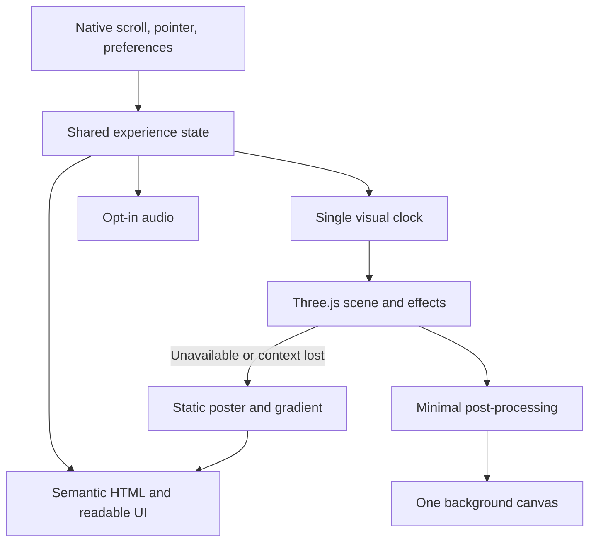

# VennStack Studio — Principal Engineer & Creative Direction Audit

**Date:** 9 September 2026  
**Scope:** All 20 source/configuration files embedded in the supplied brief, compared with the workspace; installed dependencies; production build; emitted assets; current primary documentation. Application source was not changed. Code and shader snippets are illustrative proposals; they were not applied to the app or compiled as part of this audit.

## Executive assessment

**This is a coherent ocean-themed prototype, but it is not ready for a commercial portfolio launch or an awards submission.** The strongest asset is the descent metaphor. The largest weaknesses are incomplete project/contact journeys, inaccessible entry behavior, fragmented animation ownership, and placeholder visual content. WebGL can make the concept distinctive once those foundations work.

Keep Astro, GSAP, and optionally Lenis. Introduce one progressively enhanced Three.js scene behind semantic HTML. Build a recognizable visual idea: **two intersecting currents that form the VennStack mark, descend with the visitor, and illuminate real project work.** Prioritize that signature over a collection of unrelated effects.

### Evidence and limits

- Installed versions verified: **Astro 7.0.7, GSAP 3.15.0, Lenis 1.3.25**. These match the brief. The workspace `tsconfig.json` uses explicit include/exclude entries instead of the brief's redundant `strictNullChecks` setting; `ocean-theme.css` differs only in comments.
- The default shell uses Node **20.20.2**, which fails Astro's declared runtime requirement. The existing **22.23.1** installation successfully builds the site. No runtime installation was necessary.
- Production build: **passed**, one static route. It produced two font-import warnings. Both Google Fonts imports are absent from the emitted CSS.
- Measured output: **155,682 bytes JavaScript raw / 57,292 gzip / 51,252 Brotli** across two files; **39,655 bytes CSS raw / 7,489 gzip**; HTML **33,899 bytes raw / 6,339 gzip**. Compression was calculated locally, not measured over a deployed CDN.
- An initial `npm audit` returned **six affected package entries: one critical, five high**. A second attempt to save complete JSON failed with registry DNS resolution. Individual Astro advisories were independently checked online; this is not a clean dependency-security result.
- No browser rendering, Lighthouse, axe, screen-reader session, GPU trace, or hardware benchmark was completed. The in-app browser execution tool was not available. Visual observations below are grounded in source structure; contrast figures are calculated token samples, not screenshot measurements. Performance budgets are proposed targets.
- Git status could not run because the system's Apple developer-tools path is broken. Only this report was intentionally added; the build also generated normal output/cache files.

**Severity:** 🔴 Critical = blocks a core journey or requires urgent release review; 🟡 Major = material quality, maintainability, or accessibility defect; 🟢 Minor = polish or bounded improvement. Security advisory severity is identified separately from application exploitability. References to “missing” features mean absent from the supplied repository, not proven absent from an unseen hosting account.

## 1. Architecture & code quality

### Current state

The section-sized Astro components are reasonable. Static HTML, scoped component styles, BEM classes, CSS tokens, and a small dependency surface are good choices. A React migration is unnecessary to build ambitious graphics: Astro supports client scripts alongside server-rendered content. [Astro components](https://docs.astro.build/en/basics/astro-components/).

The weakness is lifecycle ownership. Module globals, independent animation loops, timers inside components, and page-transition listeners form several overlapping runtimes. Persistence of a canvas element does not automatically give its renderer a safe lifecycle. [Astro view transitions](https://docs.astro.build/en/guides/view-transitions/).

### Findings and recommendations

| ID / severity | Evidence | Recommendation |
|---|---|---|
| A1 🔴 Critical | `src/scripts/lenis-init.ts:18` recursively schedules RAF without retaining its ID. `src/scripts/gsap-init.ts:59` also calls `lenis.raf()` from an anonymous GSAP ticker callback. | Use exactly one Lenis clock. Save and remove the ticker callback; destroy Lenis on disposal. Reinitialization currently adds RAF loops that access the newest singleton and ticker callbacks retaining old instances. This is not necessarily exactly double scroll speed, but it is duplicate advancement and leaked work. |
| A2 🟡 Major | `gsap-init.ts:223` reverts a context and calls global `ScrollTrigger.killAll()`, but does not remove the ticker callback. `Footer.astro:194` never clears its interval. Loader RAF/removal timers and HUD timers lack cancellation. | Every initializer returns an idempotent disposer. Use scoped contexts, captured timer IDs, and an `AbortController` for DOM listeners. Avoid killing unrelated triggers. Existing bubble/depth cleanup is useful and should be retained. |
| A3 🟡 Major | `depth-tracker.ts` maps the entire document linearly to 11,000 m. `gsap-init.ts` uses independent stops at 0/.15/.40/.70/1. Components display fixed depths, while CSS has another unused zone system. | Create one typed zone model tied to measured section anchors. At `#about`, HUD, palette, scene, and audio must all agree on 200 m. Recompute anchors after font/image layout changes and resize. Treat depth labels as art-directed unless scientific accuracy is separately validated. |
| A4 🟡 Major | `getZoneColors()` returns a stepped `zone.accent`; only `--accent-rgb` changes. Text using `--accent` stays cyan. `.is-twilight`, `.is-midnight`, `.is-abyss` are never applied. | Interpolate one color representation, derive both tokens, and remove or wire the unused class system. Update only changed values. Separate decorative accent from readable UI colors. |
| A5 🟡 Major | `audio-controller.ts:87` sets `isPlaying=false` only after 1.2 s; icons refresh at 100 ms. Repeated stop requests schedule multiple callbacks against mutable globals. | Use explicit off/starting/on/stopping states or one reusable context with gain ramps and suspend/resume. Cancel stale operations and update UI on actual completion. An old stop timer can affect a newly created context after rapid interactions. |
| A6 🟡 Major | `Layout.astro:239` initializes systems sequentially without failure isolation. Type assertions and non-null assertions replace several runtime checks. | If decorative initialization fails, retain usable HTML and continue unrelated initialization. Narrow with `instanceof HTMLCanvasElement`; do not assume a cast validates the DOM. Keep strict TS and add an explicit check command. |
| A7 🟡 Major | `package.json` has no check, lint, or test scripts; `@astrojs/check` and TypeScript are not installed. | Add those development tools and a small verification pipeline. A successful Astro build is not evidence that a full type check passed. Pin the supported Node version in tooling and CI. |
| A8 🟡 Major | `ClientRouter` is installed for one route; there is no case-study navigation yet. | Keep it only if upcoming case-study transitions justify the lifecycle work. If removed, replace `astro:page-load` initialization explicitly; merely removing the router would break the existing startup contract. |
| A9 🟢 Minor | `global.css` has useful tokens, but repeated hard-coded glow colors, `transition: all`, and duplicated header rules remain. `README.md` is the starter README. | Extract `SectionHeading`, `ProjectCard`, and button styles when reused; keep unique narrative sections. Document runtime ownership, assets, budgets, deployment, and the required background dev commands. |

### Dependency security

**A10 🔴 Critical release review — affected dependency versions.** `package.json` and `package-lock.json` resolve Astro 7.0.7. The critical AVIF advisory affects Astro below **7.2.8**, with the fix requiring Sharp **0.35.4**. Exploitation requires processing an attacker-controlled AVIF. This source contains no image optimization input or server image endpoint, so remote exploitation of the deployed static output has **not** been established. Build-time ingestion of untrusted future assets would also need review. Upgrade to a patched compatible release, review the lockfile, rebuild, and rerun the scan. [Astro AVIF advisory](https://github.com/advisories/GHSA-26w7-cxv4-gfx2).

Two additional Astro findings have prerequisites absent here: attacker-controlled transition animation properties for reflected XSS, and non-root `base` plus pathname-based authorization middleware for the authorization bypass. Neither follows simply from using `ClientRouter`. The initial scan also flagged transitive packages including Sharp, SVGO, and js-yaml. Resolve the complete scan before release; avoid blind `npm audit fix --force`. [Transition advisory](https://github.com/advisories/GHSA-4g3v-8h47-v7g6), [base-path advisory](https://github.com/advisories/GHSA-376h-93r7-7g6f).

### Suggested ownership boundary

```text
src/experience/
  index.ts              # initialize/dispose; preference and visibility policy
  clock.ts              # sole owner of visual updates
  zones.ts              # shared authored depth anchors and palettes
  state.ts              # depth, velocity, pointer, quality, motion preference
  scene/                # renderer, camera, resources, context recovery
  effects/              # caustics, particles, fog, optional water simulation
  audio.ts              # gesture-controlled audio state
src/content/projects/   # real case studies and verified outcomes
```

A minimal correction for the Lenis clock, **illustrative replacement, not an additional loop**:

```ts
import gsap from 'gsap';
import { ScrollTrigger } from 'gsap/ScrollTrigger';
import Lenis from 'lenis';
import 'lenis/dist/lenis.css';

export function mountScroll(): () => void {
  gsap.registerPlugin(ScrollTrigger);
  const lenis = new Lenis({ autoRaf: false, smoothWheel: true });
  const sync = () => ScrollTrigger.update();
  const tick = (seconds: number) => lenis.raf(seconds * 1000);
  lenis.on('scroll', sync);
  gsap.ticker.add(tick);
  // Set app-wide ticker policy once at bootstrap, as Lenis documents.
  gsap.ticker.lagSmoothing(0);
  let disposed = false;
  return () => {
    if (disposed) return;
    disposed = true;
    gsap.ticker.remove(tick);
    lenis.off('scroll', sync);
    lenis.destroy();
  };
}
```

The preference owner should omit this mount in reduced-motion mode, retain native scrolling, and recreate/dispose it when that preference changes. Add visuals to the same application clock after this fix. Do not let each subsystem register its own permanent scheduler. The official Lenis integration documents the milliseconds conversion and GSAP synchronization. [Lenis](https://github.com/darkroomengineering/lenis).

## 2. Visual direction & WebGL upgrade path

### Current state

**V1 🟡 Major — visual ambition is not yet expressed in the content.** `HeroSurface.astro` uses a centered wordmark and decorative waves; the following sections mostly repeat cards, thin typography, and glows. `ProjectsMidnight.astro` uses numbered placeholders. `FeaturedAbyss.astro` uses a CSS creature placeholder. There are no project images, models, textures, shaders, or Three.js dependency. This is a visual prototype, not evidence of a delivered 3D experience.

**V2 🔴 Critical — the work cannot be explored.** Project articles advertise clicking and use a pointer cursor but contain no links. The featured “VIEW CASE STUDY” points to `#contact`. Add real destinations and imagery before investing in advanced rendering. Substantiate the engagement, conversion, nomination, project-count, and client-count claims with dates and evidence; their truth cannot be determined from this repository.

### Creative proposal: an encounter at each depth

| Section | Proposed visual event | Content requirement | First implementation |
|---|---|---|---|
| Surface / hero | Two light-bearing currents intersect into a Venn-shaped aperture. Pointer movement perturbs the water. | Studio positioning and immediately available Work/Contact links. | One fullscreen shader, restrained refraction, real typography in HTML. |
| Sunlight / about | The camera passes through the aperture; caustics reveal the studio's method. | Real process evidence and selected outcomes. | Shallow geometry, projected caustics, depth fog. |
| Twilight / skills | Light diminishes; current paths trace relationships between capabilities. | Capabilities grouped by client need, not just a software inventory. | Instanced particles and sparse connective geometry. |
| Midnight / projects | A moving light reveals full-size project imagery like artifacts encountered during descent. | Image, client, role, outcome, and actual case-study URL. | DOM images first; selected images mirrored as WebGL planes. |
| Abyss / featured | One crafted luminous organism or sculpture becomes the visual climax. | Detailed flagship case study with attributable outcomes. | Authored GLB, silhouette lighting, selective bloom. |
| Hadal / contact | Motion settles; a beacon responds to focus and confirmed form states. | Clear Name, Email, Message labels and dependable delivery. | Stable HTML form; decoration remains behind it. |

**V3 🟡 Major — no hierarchy of spectacle.** Give the hero and featured project the largest visual investment. Keep the reading and contact areas quiet. Avoid forcing six equally elaborate scenes, excessive black space, or six loading pauses. The strongest differentiation will come from composition, typography, authentic work, and a consistent material language.

### Renderer and library decision

| Option | Assessment for this project |
|---|---|
| **Three.js + vanilla TypeScript** | Recommended. Its scene graph, loaders, instancing, render targets, and post-processing suit a multi-stage ocean environment. Use one renderer and shared resources. |
| **OGL** | Good alternative if the scope stays primarily fullscreen shaders and image planes. Its deliberately smaller abstraction layer leaves more scene/asset tooling to your team. [OGL](https://github.com/oframe/ogl). |
| **Custom WebGL** | Reserve for a narrowly demonstrated bottleneck or specialist effect. Owning resource management, state tracking, loaders, debugging, and browser compatibility is a substantial production cost. |
| **React Three Fiber** | Appropriate if the team already wants React scene composition and its ecosystem. It is a React renderer for Three.js, not a separate graphics engine. It can live in an Astro island; migrating the whole site to Next.js is unnecessary. [R3F](https://github.com/pmndrs/react-three-fiber), [Astro framework integration](https://docs.astro.build/en/guides/framework-components/). |
| **LYGIA** | Useful granular shader utilities. Select and vendor/pin the functions needed; confirm license requirements for the chosen revision and resolve includes at build time. [LYGIA](https://github.com/patriciogonzalezvivo/lygia). |
| **glsl-noise** | Useful noise routines if using a glslify-compatible build step. These are shader functions, not a fluid solver. [glsl-noise](https://github.com/hughsk/glsl-noise). |
| **Post-processing** | Start with Three's composer and a minimal pass chain. `@react-three/postprocessing` is relevant only to the React branch, not required for vanilla Astro. [Three post-processing](https://threejs.org/manual/en/post-processing.html), [React Postprocessing](https://react-postprocessing.docs.pmnd.rs/introduction). |
| **Spline** | Useful for early composition/interaction prototypes or an isolated scene. Do not embed separate Spline renderers in every section alongside the main ocean renderer. [Spline export](https://docs.spline.design/exporting-your-scene/web/exporting-as-code). |
| **Rive** | Consider for a reusable, designer-authored beacon or brand micro-interaction. A simple SVG/CSS status indicator does not justify another runtime. [Rive web runtime](https://rive.app/docs/runtimes/web/web-js). |

**V4 🟡 Major architectural risk — a “full-canvas” experience must still have a complete HTML interface.** Keep headings, links, project descriptions, controls, and the form in the DOM. The canvas supplies the world. If an image is duplicated into WebGL, only the HTML version owns its link and accessible description. Avoid serializing DOM screenshots to textures.



### Caustic light shader

**V5 🟡 Major gap — CSS gradients do not produce water-light behavior.** Replace `.caustics` in `ocean-theme.css` with a material-space pattern on rock, floor, or a shallow background mesh. Modulate energy by depth and light direction; distort world-space coordinates with low-frequency flow. A fullscreen version is the first milestone; projected, occlusion-aware light is a later refinement.

This original GLSL fragment function produces inexpensive, art-directed ridges. It is **not a physically accurate caustics simulation**. Inputs use scene units, seconds, normalized depth, and linear RGB; compose output into the scene before final display conversion.

```glsl
float causticRidges(vec2 p, float time) {
    p += 0.20 * vec2(sin(p.y * 1.7 + time * 0.31),
                     cos(p.x * 1.3 - time * 0.27));
    float a = sin(p.x * 4.1 + sin(p.y * 3.2 + time * 0.4));
    float b = sin(p.y * 4.7 + cos(p.x * 2.8 - time * 0.3));
    float ridge = 1.0 - smoothstep(0.03, 0.28, abs(a + b));
    return ridge * ridge;
}

vec3 applyCaustics(vec3 baseLinear, vec3 worldPosition,
                   float time, float depth01, float facingLight) {
    float pattern = causticRidges(worldPosition.xz * 0.7, time);
    float shallow = 1.0 - smoothstep(0.02, 0.35, depth01);
    vec3 light = vec3(0.15, 0.70, 0.85); // linear, art-directed
    return baseLinear + light * pattern * shallow
        * clamp(facingLight, 0.0, 1.0) * 0.22;
}
```

Use a baked caustic atlas on the low tier. For the hero's signature close-up, consider deriving caustics from a water height/normal field only after the basic version meets its budget. A convincing result depends heavily on scale, direction, restraint, and surface material.

### Fog and god rays

**V6 🟡 Major gap — CSS rays have no relationship to scene depth or occlusion.** Start with depth-based absorption and a few translucent light shafts. On high quality, ray-march single scattering at half or quarter resolution, stop at scene depth, jitter samples, and use depth-aware upsampling. Add temporal accumulation only with history rejection on fast camera movement and route changes.

For a basic fog material, separate camera-to-surface distance from the authored ocean-depth scalar. RGB extinction lets red disappear faster than blue. This is an artistic water approximation:

```glsl
vec3 underwaterFog(vec3 surfaceLinear, float viewDistance,
                   vec3 extinction, vec3 waterLinear) {
    vec3 transmission = exp(-max(extinction, vec3(0.0))
                            * max(viewDistance, 0.0));
    return surfaceLinear * transmission
         + waterLinear * (vec3(1.0) - transmission);
}
```

For advanced scattering, accumulate `transmittance * light * density * stepLength` along the ray, then attenuate transmittance per step. Begin with 16–24 samples, measured on target devices. Those counts are prototype settings, not a performance guarantee. Never blur or fog the HTML text to achieve immersion.

### Water, fluid simulation, and cursor distortion

**V7 🟡 Major scope risk — a GPU fluid solver and a water surface are different systems.** Use a damped height field for surface ripples, normals, and refraction. Use a 2D velocity/dye solver only where circulating currents add visible value. A full incompressible solver requires velocity advection, pointer impulses, divergence, iterative pressure solve, and projection; it is not one inexpensive shader. [NVIDIA GPU fluid chapter](https://developer.nvidia.com/gpugems/gpugems/part-vi-beyond-triangles/chapter-38-fast-fluid-dynamics-simulation-gpu).

Proposed order:

1. Cheap pointer-responsive normal/flow texture on the hero.
2. A ping-pong height field at 128² or 256², a fixed simulation timestep, clamped impulses, damping, and a stable integration coefficient.
3. Optional high-tier velocity/pressure simulation, initially around 128²–256² with measured iteration counts; pause it outside the hero.

Illustrative height-field step, storing current and previous height in RG of alternating textures:

```glsl
uniform sampler2D uState;
uniform vec2 uTexel;
uniform float uC2;      // choose <= 0.5 for this 2D stencil
uniform float uDamping;
uniform vec2 uPointer;
uniform float uImpulse;
in vec2 vUv;
out vec4 fragColor;

void main() {
    vec2 state = texture(uState, vUv).rg;
    float h = state.r;
    float lap = texture(uState, vUv + vec2(uTexel.x, 0.0)).r
              + texture(uState, vUv - vec2(uTexel.x, 0.0)).r
              + texture(uState, vUv + vec2(0.0, uTexel.y)).r
              + texture(uState, vUv - vec2(0.0, uTexel.y)).r - 4.0 * h;
    float next = (2.0 * h - state.g + uC2 * lap) * uDamping;
    vec2 d = vUv - uPointer;
    next += exp(-dot(d, d) * 1400.0) * uImpulse;
    fragColor = vec4(clamp(next, -1.0, 1.0), h, 0.0, 1.0);
}
```

This is a GLSL ES 3.00 step body requiring a compatible vertex shader, precision/version setup, initialized floating-point render targets, clamp-to-edge sampling, and verified renderability. Read one target and write the other, then swap. Never sample the active draw attachment. Derive normals using neighboring heights; displace the scene-color UV by the resulting slope. Correct pointer distance for aspect ratio. Limit catch-up steps after a suspended tab; clear history when resizing targets.

**V8 🟢 Minor opportunity — custom cursor.** Keep the native cursor and add a trailing disturbance to the canvas. Enable on `(hover: hover) and (pointer: fine)`. Touch can trigger a brief ripple on deliberate taps without preventing page scroll. Disable displacement around focused text inputs and in reduced-motion mode. Magnetic buttons should move an inner visual, preserving the actual hit target.

### Bioluminescent particles and 3D environment

**V9 🟡 Major gap — bubbles have no spatial scale or world continuity.** Replace them with one `Points` draw or instanced quads, seeded attributes, shader-driven drift, and depth attenuation. Start around 500–1,500 particles on a mobile tier and 3,000–8,000 on a high tier; tune projected pixel coverage first. These are trial ranges, not requirements. More particles can be slower despite one draw call because transparency still causes overdraw.

Use small dim marine snow, rare near-camera specks, and sparse brighter bioluminescence. Avoid hundreds of actual lights: emissive particles plus selective bloom are sufficient. Use `depthWrite=false` for transparent particles with an intentional sorting/blending strategy; retain depth testing against solid geometry. A sinusoidal displacement is flow-like motion, not a fluid simulation.

**V10 🟡 Major production gap — no 3D asset pipeline.** Author a compact reef/seafloor composition and one hero creature in Blender. Bake normal/AO detail, instance debris, provide mesh LODs, and load chapters as needed. Use GLB plus KTX2 textures and a chosen geometry-compression path such as Meshopt or Draco. Profile decode time as well as transfer size. A tiled seabed revealed in selected views is sufficient; do not build an eleven-kilometer simulation.

### Post-processing and WebGPU

**V11 🟡 Major performance risk — the proposed effects cannot all be mandatory.** Begin with:

```text
Opaque scene + depth
  → transparent particles
  → optional low-resolution fog composite
  → selective, low-resolution bloom
  → subtle water distortion / grade
  → tone mapping + output color conversion, exactly once
  → HTML interface above the canvas
```

Use tiny grain only if it improves the image. Leave depth of field and chromatic aberration off by default; enable locally for a brief focal moment on high quality. Multiple full-resolution passes can cost more than geometry. Do not apply bloom to every element or chromatic splitting to readable UI. The composer approach is documented by Three.js; benchmark the final pass chain rather than presuming individual effects are cheap. [Three post-processing](https://threejs.org/manual/en/post-processing.html).

**V12 🟢 Minor future option — WebGPU.** Run a short compatibility prototype against the chosen Three.js revision before committing. Its WebGPU renderer uses a different material/post-processing approach; custom GLSL and an existing WebGL composer chain do not automatically migrate. A TSL-oriented implementation is an option if backend portability is worth the upfront work. Keep scene state and assets independent of the renderer, retain WebGL/static fallback, and do not assume WebGPU fixes fill-rate or thermal limits. [Three WebGPURenderer](https://threejs.org/docs/pages/WebGPURenderer.html), [WebGPU post-processing](https://threejs.org/manual/en/webgpu-postprocessing.html).

### Benchmarks: what to study

These are creative study targets, **not claims about their private engines or exact shader implementations**. Historical award versions may differ from today's sites. Several current sites expose little useful content without a browser; no live visual reverse-engineering was performed here.

| Benchmark | Apply to VennStack |
|---|---|
| [Active Theory](https://activetheory.net) | World continuity, transitions between environments, and shared scene state. Study for the water column/camera architecture. |
| [Bruno Simon](https://bruno-simon.com) | A memorable interaction premise and authored 3D composition. The current site explicitly credits Three.js/TSL and offers quality controls; it is also a useful public architecture reference. Use the clarity of the central idea; do not add game controls merely to imitate it. |
| [Lusion](https://lusion.co) | Material polish, disciplined lighting, and strong project presentation. Study for caustics, bloom restraint, and the flagship scene. Lusion v3 is listed as 2023 Site of the Year in Awwwards' archive. [Award listing](https://www.awwwards.com/websites/%23F0EBE7/?page=14). |
| [Monopo London](https://monopo.london) | A distinctive brand atmosphere and interaction language for the hero. Its 2021 version received CSSDA Website of the Day; use that dated version when discussing the benchmark. [CSSDA record](https://www.cssdesignawards.com/sites/monopo-london/39854/). |
| [Aristide Benoist](https://aristidebenoist.com) | Editorial rhythm, image-to-type relationships, and scroll pacing for project discovery. |
| [Midwam](https://midwam.com) | Spatial narrative and chapter navigation. The current site is different enough that the brief's “underwater effects” claim should not be treated as verified. |
| [Resn](https://resn.co.nz) | A small number of surprising, characterful interaction moments, suitable for the creature/beacon. |
| [14islands](https://www.14islands.com/) and its listed Blobmixer project | Organic form exploration for currents, particles, and fluid-like response; judge the technique against a clear visual purpose. |

The verification bar for an award claim is the awarding body's record. A nomination, a studio-wide award total, and an award for a specific site version are different facts. Lusion publishes FWA recognition on its own [about page](https://lusion.co/about/); that does not establish an FWA win for every listed reference.

## 3. Animation & interaction design

### Current state

GSAP contexts, transforms, grouped reveals, and passive scroll listeners are sensible starting points. However, most content uses the same entrance vocabulary, several elements have multiple transform owners, and the intro progresses independently of the visitor. Lenis is a valid optional enhancement, but is currently integrated incorrectly.

| ID / severity | Finding | Recommendation |
|---|---|---|
| M1 🟡 Major | Hero reveal tweens start during the loader. HUD/audio visibility follows fixed 2.5/2.8-second timers rather than entry. | Use a real entry state/event. Begin the hero timeline when the visitor enters, or remove the mandatory entrance flow entirely. Provide immediate silent access. |
| M2 🟡 Major | `scrub: 0.5` is set on the background's callback-only ScrollTrigger. | Numeric scrub smooths an attached animation's playhead; it does not inherently smooth arbitrary `onUpdate` writes. Tween a state object's progress and render from it, or use explicit delta-time damping. Confirmed against the installed ScrollTrigger implementation. |
| M3 🟡 Major | `.reveal-up` and `[data-parallax]` coexist on the hero CTA; scale/parallax coexist on the radar; inline GSAP transforms also compete with card hover transforms. | Put reveal, hover, and parallax on separate nested elements. Have only one owner for each element's transform. |
| M4 🟡 Major | `toggleActions: 'play none none reverse'` can hide content again as the user scrolls back above it. | Reveal reading content once. Keep reversible scrubbing for scenery. Ensure keyboard focus immediately reveals any focused control or link. |
| M5 🟡 Major | Motion preference affects CSS timing only; JS reveals, parallax, canvas, and Lenis continue. | Use a shared preference controller and `gsap.matchMedia()`. Revert the motion context when reduced motion activates; show content in its natural layout and stop decorative updates. |
| M6 🟡 Major | “Hover to illuminate. Click to explore.” promises interactions not implemented in project cards; skills hover effects are decorative only. | Add real anchors to projects, with equivalent focus styling. Keep skills as a semantic list unless selecting one actually performs an action. Decorative cards do not need extra tab stops. |
| M7 🟢 Minor | Lenis styles are not imported, while `touchMultiplier` is set without enabling simulated touch smoothing. | Import its official CSS, keep native touch by default, and test nested scrolling in the textarea, hash links, browser history, and keyboard scrolling. `touchMultiplier` alone is not proof of a custom touch experience. |
| M8 🟢 Minor | No distinctive typography choreography or meaningful transition to a case study. | Add a short line-based hero reveal after fonts are ready. Use a project image/heading continuity transition once routes exist; provide a direct/static transition under reduced motion. |

Recommended motion grammar: 120–180 ms for control feedback; roughly 500–800 ms for selective reveals; slow environmental motion with little camera roll. These are art-direction starting points. Use scroll position for scene progression and velocity only for restrained transient effects such as current strength. Avoid stacking Lenis lag, numeric scrub, and several additional damping layers on the same value.

For SplitText, use automatic resplitting for responsive line changes, retain the accessible heading name, return/revert animations correctly, and avoid splitting interactive descendants without additional accessibility work. Two manually authored hero lines may be sufficient here; a plugin is justified only by the final choreography. DrawSVG suits one sonar/mark reveal; Flip suits an actual layout transition. Do not add every GSAP plugin. [SplitText documentation](https://gsap.com/docs/v3/Plugins/SplitText/).

Physics should support feedback: a damped spring for a cursor disturbance or an inner button visual. Use elapsed time, cap the timestep after tab restoration, and never let simulated motion alter the actual link target. A physics engine is unnecessary unless the design includes meaningful collisions or manipulation.

**Benchmark application:** use Aristide Benoist for editorial timing, Monopo for a coherent hero interaction, and Bruno Simon for interaction clarity. For implementation correctness, use [ScrollTrigger's documented lifecycle and callbacks](https://gsap.com/docs/v3/Plugins/ScrollTrigger/) rather than inferring architecture from an award site's appearance.

## 4. Performance engineering

### Current state and measured bundle

The current site has no heavy media payload. Its initial JavaScript is moderate, so replacing the framework is not the highest-impact optimization. The existing runtime has avoidable recurring work. WebGL will introduce a different bottleneck profile: pixel count, transparency, render targets, uploads, compilation, and thermal behavior.

| Production asset | Raw bytes | Gzip bytes | Brotli bytes |
|---|---:|---:|---:|
| Layout/application JS | 139,616 | 51,802 | 46,346 |
| ClientRouter JS | 16,066 | 5,490 | 4,906 |
| CSS | 39,655 | 7,489 | 6,516 |

These are emitted file sizes. The layout chunk includes libraries and application logic; no source-map attribution was performed. Removing `ClientRouter` would also change startup/lifecycle code, so its current compressed size is not a guaranteed net saving.

### Current rendering defects

| ID / severity | Evidence / implication | Recommendation |
|---|---|---|
| P1 🟡 Major | `bubble-engine.ts` draws up to 120 bubbles with two arcs each, changing shadow/color state per particle on a full-screen DPR-capped canvas. | Profile shadow blur first. As an interim fix, pre-render a few glow sprites and use `drawImage`; then migrate to instancing only as part of the wider scene. Do not assume 120 particles are inherently expensive. |
| P2 🟡 Major | `bubble.y -= bubble.speed` is per frame; X wobble is accumulated per frame and has no horizontal wrap. | Express velocity in units/second. Compute bounded wobble around a base X and wrap/reseed intentionally. At 120 Hz the current vertical motion advances about twice as fast as at 60 Hz. |
| P3 🟡 Major | HUD RAF writes formatted text, zone text, and pressure width continuously even when unchanged. | Update values only when changed; stop interpolation when settled. Use a transform-scaled pressure bar. One shared clock does not mean every subsystem must update on every tick. |
| P4 🟡 Major | Bubble/depth progress divides by `scrollHeight - innerHeight`; zero causes NaN. Bubble initialization does not sample the current scroll position. Depth geometry is not updated on resize alone. | Guard the denominator, sample initial/restored scroll, and update cached dimensions on layout change. Recompute shared anchors once per resize/refresh. |
| P5 🟡 Major | Full-viewport gradient strings are rewritten during scroll; cards use backdrop blur; grain blends over the whole viewport; sonar/ripple CSS changes dimensions. | Measure paint/compositing. Crossfade fixed layers for the interim background, or move the visual into the scene. Animate ring transforms instead of width/height. Reduce mobile backdrop effects. |
| P6 🟡 Major | Google Fonts imports follow ordinary CSS rules at `global.css:54`. Build warns and removes them. `Layout.astro` only preconnects, despite a “Fonts preload” comment. | Fix the loading path before optimizing it. Prefer local WOFF2 subsets with `font-display: swap`, explicit weight ranges, and metric-compatible fallback. Preload only the essential above-fold font; check reflow afterward. |
| P7 🟡 Major | Audio creates a ten-second stereo float buffer synchronously on entry; LFO/source work continues without a visibility policy. | Reuse the context, defer nonessential processing, and measure click latency. Consider a small prepared seamless loop if synthesis costs exceed the budget. Pause/suspend according to visibility and user preference. |
| P8 🟡 Major | No renderer capability/quality policy, context recovery, or graphics failure path exists for the proposed upgrade. | Make those part of the first renderer milestone, before advanced effects. |

The font issue is more specific than “Google Fonts is blocking”: **the font stylesheets are not present in this build at all**. The import ordering constraint is documented by [MDN](https://developer.mozilla.org/en-US/docs/Web/CSS/Reference/At-rules/@import); Astro supports ordinary global and scoped CSS without a Tailwind migration. [Astro styling](https://docs.astro.build/en/guides/styling/).

A safe progress calculation for the interim implementation:

```ts
const maxScroll = document.documentElement.scrollHeight - innerHeight;
const progress = maxScroll > 0
  ? Math.max(0, Math.min(1, scrollY / maxScroll))
  : 0;

// Frame-rate-independent smoothing; dt is elapsed seconds.
const alpha = 1 - Math.exp(-12 * Math.min(dt, 0.05));
displayDepth += (targetDepth - displayDepth) * alpha;
```

Audio-specific detail: at 48 kHz, a ten-second stereo Float32 buffer alone is **3.84 MB decimal**. The inner loop writes future samples for bubble pings, but the outer loop subsequently overwrites those samples; the intended ping envelope does not survive as written. Generate the base noise first and add sparse envelopes in a second pass. The filter is driven by an LFO, **not scroll depth**: connect shared depth to an `AudioParam` target with smoothing if depth-responsive audio remains in scope. Reuse/crossfade a seamless loop and test headphones and device speakers.

### Quality tiers and budgets

These are proposed acceptance targets for the integrated experience, to be revised with traces. Set a named mid-range Android model and browser in Phase 1; “mobile” is not a reproducible benchmark.

| Tier | Rendering policy | Starting budget |
|---|---|---|
| Static / reduced motion / graphics failure | DOM, poster/gradient, native scroll; no continuous GPU animation | Readable and navigable before any renderer imports. |
| Low | DPR near 1; sparse particles; baked caustics; no fluid, DOF, or volumetric pass | Sustained 30 fps on agreed mid-range Android; 95th-percentile frame interval near/below 33.3 ms in a steady scripted scroll. |
| Medium | DPR cap around 1.25; more particles; reduced-resolution bloom; simple shafts | Maintain the selected 30/60 fps target over a ten-minute thermal run. |
| High | DPR cap initially 1.5; richer geometry; optional 256² simulation; low-resolution fog | 60 fps target on M1 MacBook Air; roughly 16.7 ms frame interval, with GPU work initially budgeted around 8–10 ms. |

Dynamic quality should respond to sustained frame pressure, not user-agent labels alone. Use hysteresis and long recovery windows so the image does not oscillate between settings. Avoid promotion during active interaction. Capability checks must include required render-target formats and successful shader compilation, not merely the existence of `WebGL2RenderingContext`.

Start with an initial enhancement payload target of **≤350 KB gzip JavaScript**, and **≤1.5 MB transferred first-scene media**. Treat these as project budgets, not library-size claims. Lazy-load later chapter assets and larger visual variants after the first scene is usable. Publish the HTML immediately; a loader must not gate access to content while optional assets download.

Memory planning matters more than compressed GLB size. A 1920×1080 RGBA16F color target is about **15.8 MiB**; at DPR 2 it is about **63.3 MiB**. Two full-resolution ping-pong buffers at that DPR already exceed **126 MiB**, before depth, textures, multisampling, or bloom. Cap pixel count and render expensive effects at reduced resolution. A compressed texture's download size is not its resident GPU footprint.

### Loading, visibility, workers, and cleanup

**P9 🟡 Major prospective risk — unbounded graphics lifetime.** Define asset ownership and dispose geometries, materials, textures, render targets, passes, and listeners when their owner ends. Retain only shared resources across routes. Stop the render tick while hidden; reset simulation timing when returning. Handle `webglcontextlost` by exposing the fallback and stopping work, then rebuild resources on restoration or remain in static mode after bounded failure. Test this with a forced context loss, not just a try/catch around construction.

Use dynamic imports after baseline content is available, and initialize when the scene is needed. Shader/asset warm-up can be staged between interactions. Do not rely solely on an idle callback: it can be delayed indefinitely on a busy page. Delay disposal briefly only if it solves real back-navigation reuse; otherwise clear resources deterministically.

**P10 🟢 Minor optimization candidate — workers/OffscreenCanvas.** First move costly model decoding or procedural data generation off the main thread if traces justify it. Moving the whole renderer to OffscreenCanvas changes resize, input, asset, and debugging architecture and does not reduce GPU fill cost. Feature-detect and prove a benefit before adopting it. Avoid cross-origin isolation headers solely for speculative worker optimization.

**P11 🟡 Major validation gap — no measured UX/performance baseline.** Track Core Web Vitals at the 75th percentile: **LCP ≤2.5 s, INP ≤200 ms, CLS ≤0.1**, separately for mobile and desktop. Target Lighthouse Performance ≥90 on an agreed mobile profile and Accessibility 100 for applicable automated checks, while retaining manual acceptance. These scores neither certify WCAG compliance nor guarantee sustained GPU performance. [Web Vitals definitions](https://web.dev/articles/vitals).

Use Chrome Performance/Rendering tools for main-thread and paint work, Spector.js for WebGL frame inspection, and available GPU timers without blocking readbacks. Capture entry, slow/fast scroll, form focus, resize, ten minutes idle, and repeated navigation. Keep a record of renderer resource counts and retained heap after repeated mount/dispose cycles. Test actual Safari/iOS and Android hardware; a desktop CPU throttle cannot emulate their GPUs.

**Benchmarks:** performance traces and these budgets are the reference standard. The listed creative studios are inspiration, not proof that the same effects run within VennStack's target devices or network budgets.

## 5. Accessibility — WCAG 2.2 AA

### Current state

The page has `lang="en"`, a title/description, a main element, a real H1, explicit form labels, required fields, email input type, and name/email autocomplete. Those are valuable foundations. A reduced-motion CSS rule exists but does not govern JavaScript. There is no basis to claim WCAG conformance from this source review.

| ID / severity | Finding and affected file | Remediation / acceptance |
|---|---|---|
| X1 🔴 Critical | `Loader.astro` is visible by default and requires JS to dismiss. With JS disabled or failed, the full-screen overlay remains indefinitely. | Default to accessible content. Activate an optional intro only after its controls/listeners are ready, or replace it with an inline sound choice. A no-JS stylesheet alone does not cover script-load failures. |
| X2 🔴 Critical | Loader has no modal semantics, background inertness, scroll management, initial focus, or focus restoration. Opacity-zero buttons remain focusable; the audio control appears earlier in DOM order. | Prefer a nonblocking intro. If retained as a modal, place it outside the inert content container, use a correctly named dialog, set initial focus, support dismissal, and focus a stable heading on exit. Stop scrolling only while that modal is active, then restore it. |
| X3 🟡 Major | `global.css`, section labels, and footer use low-alpha text. | Use readable, role-based text colors and deterministic dark surfaces behind important text. Test every zone, transition, hover/focus state, and animated bright background. |
| X4 🟡 Major | GSAP and canvas ignore reduced motion; many decorative animations continue beyond five seconds with no pause control. | Add a visible “Pause effects” control and honor OS changes at runtime. Pause decorative canvas/CSS motion, skip camera parallax and fluid simulation, and keep all content visible. Assess SC 2.2.2 applicability for moving content; do not assume CSS duration reduction covers the whole system. |
| X5 🟡 Major | Project cards are not links; case-study destination is misleading; four social links have `href="#"`. | Use real anchors with useful names and focus styles. Remove unconfigured social links. Make Work and Contact reachable directly from the top. |
| X6 🟡 Major | No skip link; input styles remove outlines and replace them with a faint glow. | Add a visible-on-focus skip link and strong focus indicators. Verify focused controls are not covered by loader, HUD, or mobile keyboard. |
| X7 🟡 Major | `audio-toggle` has a generic label and no pressed state; UI can remain wrong after stop. | Expose `aria-pressed`, use a stable name such as “Ambient sound”, synchronize with actual playback, and handle failures. Silence remains default; no sound is necessary to navigate. |
| X8 🟡 Major | Contact labels use “Callsign”, “Frequency”, and “Transmission”; there is no authored status/error flow. | Keep metaphor as secondary copy; show Name, Email, Message explicitly. Preserve entered values on error, identify fields, and announce success only after a confirmed provider/server response. |
| X9 🟢 Minor | Depth labels use H6 before H2; About uses H4 under H2; footer sits inside the main slot. Decorative SVG/canvas is not explicitly hidden from assistive technology. | Render zone eyebrows as paragraphs, use a logical heading hierarchy, move the site footer outside main for a contentinfo landmark, and mark purely decorative graphics `aria-hidden="true"` and nonfocusable. Skipped heading levels are a structural concern, not automatically a WCAG failure in isolation. |
| X10 🟢 Minor | HUD updates every frame; footer clock updates every second. | Do not make the meter a per-frame live region. Give it a static descriptive label or mark it decorative; if useful, announce zone changes sparingly. Label the clock as visitor-local time or specify the studio timezone. |

The loader/focus risks relate to [Focus Not Obscured](https://www.w3.org/WAI/WCAG22/Understanding/focus-not-obscured-minimum.html). Status handling should follow [Status Messages](https://www.w3.org/WAI/WCAG22/Understanding/status-messages.html). Continuous moving information must be assessed against [Pause, Stop, Hide](https://w3c.github.io/wcag/understanding/pause-stop-hide). Animation from interactions is a separate AAA criterion; do not mislabel all reduced-motion issues as an automatic AA violation.

### Calculated contrast samples

I alpha-composited each text token over the specified flat RGB background, then used WCAG relative luminance. These samples exclude gradient position, ancestor opacity, grain, blending, and glow. They demonstrate unsafe tokens, but are **not a complete all-pixel conformance result**.

| Background sample | Primary `#CAF0F8` | Secondary at 70% | White at 45% (“muted”) | White at 20% (“ghost”) | Accent `#48CAE4` |
|---|---:|---:|---:|---:|---:|
| Surface `#0077B6` | 4.02 | 2.75 | 2.14 | 1.41 | 2.51 |
| `#023E8A` | 8.42 | 4.96 | 3.29 | 1.71 | 5.27 |
| `#03045E` | 14.65 | 7.35 | 4.10 | 1.68 | 9.17 |
| `#010A26` | 16.16 | 8.08 | 4.46 | 1.76 | 10.11 |
| Black | 17.33 | 8.35 | 4.41 | 1.66 | 10.84 |

**X11 🟡 Major — muted text fails 4.5:1 at all five samples; ghost text is especially unsuitable for meaningful labels.** Normal text needs 4.5:1; qualifying large text needs 3:1. Do not round 4.46 up to a pass. Large thin type is not bold large type, and glow does not establish compliant foreground contrast. [Contrast Minimum](https://www.w3.org/WAI/WCAG22/Understanding/contrast-minimum.html).

Define an opaque reading surface such as the deep navy already used in the loader, then choose text and focus colors against that surface. Keep scene colors separate. In a shader-driven background, test endpoints and intermediate states, but make the design safe by construction rather than relying on sparse samples of arbitrary bright animation.

**X12 🟢 Minor — target sizing needs device validation.** The audio control is 40×40 CSS px, so it does **not** fail AA simply for being smaller than 44 px. WCAG 2.2 AA's target-size minimum is generally 24×24 with specified exceptions; 44×44 is a good product target and the enhanced criterion uses that size. Check spacing, zoom, and the actual targets rather than reporting a blanket failure. [Target Size Minimum](https://www.w3.org/WAI/WCAG22/Understanding/target-size-minimum.html).

Suggested HTML patterns:

```html
<a class="skip-link" href="#main-content">Skip to content</a>
<button type="button" aria-pressed="false" id="effects-toggle">
  Pause effects
</button>
<main id="main-content" tabindex="-1">…</main>

<label for="contact-email">Email</label>
<input id="contact-email" name="email" type="email"
       autocomplete="email" required aria-describedby="email-error">
<p id="email-error"></p>
<p id="form-status" role="status" aria-live="polite"></p>
```

Set `aria-invalid="true"` only for an actual invalid field. Keep the live region mounted before changing its text. Native validation is already present; a custom error system should add clarity rather than replace working native behavior without reason. Use a strong `:focus-visible` outline, not only a box shadow, and verify forced-colors mode.

### Required manual acceptance

- Complete entry, project discovery, contact, sound, and effect controls with Tab/Shift+Tab/Enter/Space/Escape as appropriate. No invisible or obscured focus.
- Verify no-JS, failed-JS, unsupported WebGL, and context-loss paths. Information and links remain available.
- Test reduced motion at startup and after toggling the OS preference; preserve user position and visibility.
- Test VoiceOver/Safari and NVDA with a supported desktop browser: heading structure, link purpose, field errors, and status announcements.
- Test 320 CSS px width, 200% text zoom and 400% page zoom/reflow, mobile landscape, forced colors, and the on-screen keyboard. Inspect fixed HUD overlap and the 100vh section behavior; prefer content-led sizing with appropriate `svh`/`dvh` use.
- Validate text, essential control boundaries, focus rings, and status icons over all relevant backgrounds. Ensure essential information never depends on hover, color, or sound alone.

**Benchmarks:** WCAG/WAI criteria and manual task completion are authoritative. Awards-site interaction patterns are not accessibility evidence.

## 6. Deployment & infrastructure

### Current state

`astro.config.mjs` is empty and the build emits a static page. That is appropriate for this content. There is no supplied CI workflow, platform configuration, monitoring setup, sitemap, robots file, or deployment-header policy. There are favicon files, but the layout does not explicitly link the SVG icon. Do not equate minimal configuration with an unoptimized bundler: Astro/Vite already build and minify assets.

| ID / severity | Finding | Recommendation |
|---|---|---|
| D1 🔴 Critical | `ContactBeacon.astro:65` contains `YOUR_ACCESS_KEY`. | Configure a real destination and validate delivery in a controlled test environment. No form submission was sent during this audit. Preserve the mailto option. |
| D2 🟡 Major | No build/check/security gate; runtime version depends on shell setup. | Pin Node 22.23.1 or a deliberately updated supported version, use `npm ci`, explicit type checking, linting, build, and targeted browser checks. Review build warnings as failures to resolve. |
| D3 🟡 Major | No documented caching, recovery, error monitoring, or security-header policy. | Add host-specific cache and security configuration, deployment previews, rollback, and client error/graphics fallback reporting. Validate actual response headers after deployment. |
| D4 🟡 Major | No canonical URL, `og:url`, share image, or case-study metadata. | Set the real production `site`, route-specific metadata, a genuine share image, and a sitemap once routes exist. Include image dimensions and alt text. Do not invent an unconfirmed production domain. |
| D5 🟢 Minor | All project content is inline arrays/markup. | Start with typed data; adopt Astro content collections for multiple case studies, schema validation, and asset metadata. A CMS is optional. |

The Web3Forms access key is intentionally public according to the provider; putting it in an environment variable does not make it secret if it is emitted to HTML. The issue is the placeholder and missing delivery verification. If you need confidential service credentials or custom abuse controls, use a server-side endpoint with those secrets. [Web3Forms access-key FAQ](https://docs.web3forms.com/getting-started/faq).

### Hosting comparison and rendering choice

| Platform | Fit | Tradeoff / decision |
|---|---|---|
| **Cloudflare Pages** | Suitable default for the static `dist` output, CDN delivery, and preview deployments. | Add separate functions only for actual server needs; verify current adapter/runtime support before changing to SSR. [Cloudflare Astro guide](https://developers.cloudflare.com/pages/framework-guides/deploy-an-astro-site/). |
| **Vercel** | Equally reasonable if the team already uses its deployment and preview workflow. | Static output needs no SSR adapter. Introduce the adapter only for on-demand rendering/server features. [Astro on Vercel](https://docs.astro.build/en/guides/deploy/vercel/). |
| **Netlify** | Reasonable for a static marketing portfolio and integrated deployment workflow. | Its form handling is an alternative to Web3Forms, requiring configuration and validation; avoid operating two submission paths accidentally. [Astro on Netlify](https://docs.astro.build/en/guides/deploy/netlify/). |

Recommendation: **SSG on the team's existing supported host, with Cloudflare Pages a sensible default if there is none.** Hosting will not fix an overloaded render pipeline. No measured cost or speed comparison was performed, and no pricing assumptions are necessary for this decision.

Use pre-rendered `/work/[slug]/` pages for projects. Add on-demand endpoints only where runtime data is necessary; there is no need for personalized SSR or ISR for this portfolio. Rebuild on content changes. “Hybrid” describes mixed rendering behavior here, not a reason to copy an older `output: 'hybrid'` configuration. [Astro routing](https://docs.astro.build/en/guides/routing/), [content collections](https://docs.astro.build/en/guides/content-collections/).

Possible edge work: a validated contact endpoint, rate limiting, or small cached metadata. Shader execution remains on the user's device. Avoid sending renderer state to a server just because edge functions are available.

### Assets, caching, and release pipeline

Use content-hashed asset filenames and `Cache-Control: public, max-age=31536000, immutable` for immutable JS, CSS, models, and textures. Revalidate HTML and asset manifests so new releases are discoverable. Retain old hashed assets long enough for open tabs/back navigation. If large assets move to object storage/CDN, configure content types, CORS, and cache headers for the actual origin; use same-origin delivery where it simplifies operation.

Preload only the genuine LCP image/font. Preload every model and HDRI and you defeat progressive loading. Downscale HDR environments for the intended specular detail; a dark stylized ocean may need no large HDRI at all.

Proposed CI sequence:

1. Supported pinned Node; `npm ci`; `npm run check` after adding `astro check`; lint and build.
2. Fail on invalid content schemas, broken internal links, missing project assets, and unresolved critical/high dependency findings without documented applicability review.
3. Browser smoke tests against a production build: no-JS access, reduced motion, keyboard entry, project links, controlled form success/error, rapid audio toggles, route cleanup, and graphics failure.
4. Automated accessibility scan and bundle-size budgets. Keep GPU/device tests as a separate repeatable run.
5. Preview with noindex/protection, test contact destination, environment-specific analytics settings; then deploy the validated artifact and retain rollback.

GitHub Actions or equivalent CI is sufficient; there is no reason to introduce a new orchestrator. Update the README with the supplied development convention: `astro dev --background`, `astro dev status`, `astro dev logs`, and `astro dev stop`.

### Security headers and CSP

**D6 🟡 Major hardening gap — CSP must match the emitted build and chosen integrations.** The installed Astro configuration schema supports CSP under `security`. Build-generated hashes can cover emitted inline scripts/styles, but current inline style attributes, dynamic GSAP style updates, data-URL grain, future workers/WASM decoders, and third-party form requests all need deliberate validation. Do not paste `script-src 'self'` and assume the site still works. [Astro configuration reference](https://docs.astro.build/en/reference/configuration-reference/).

Start with a **report-only HTTP policy on preview**, inventory violations, then enforce a tested policy. Conceptual policy template, not a deployable header as written:

```text
default-src 'self';
script-src 'self' <build-generated script hashes>;
style-src 'self' <build-generated style hashes>;
img-src 'self' data: <chosen asset origin>;
font-src 'self';
connect-src 'self' <form/asset/monitoring origins actually used>;
form-action 'self' https://api.web3forms.com;
object-src 'none'; base-uri 'self'; frame-ancestors 'none';
```

Replace angle-bracket placeholders with the exact required sources. Move existing inline authored styles to classes where practical. Validate runtime style behavior under the policy; a style-element hash does not automatically authorize style attributes. Add worker sources and narrowly scoped WASM permission only if the selected decoders require them. If switching to a same-origin contact endpoint, remove unused third-party form permissions.

Deliver `frame-ancestors` as an HTTP header; it is not supported through a meta CSP. [MDN frame-ancestors reference](https://developer.mozilla.org/en-US/docs/Web/HTTP/Reference/Headers/Content-Security-Policy/frame-ancestors). Add `X-Content-Type-Options: nosniff`, an intentional referrer policy, and permissions restrictions for unused device capabilities. Enable HSTS for the production HTTPS domain only after confirming subdomain requirements. Avoid a blanket `unsafe-eval` exception. Keep source maps available privately for error diagnosis.

### Monitoring and form reliability

Record client exceptions, asset load failures, context loss, chosen quality tier, sampled frame timing, and Core Web Vitals. Use a tool such as Sentry or an existing error collector, with a small sampled integration and scrubbed payloads. Do not capture message contents or email addresses in client telemetry. Separate lab metrics from field metrics, and track successful project navigation and confirmed contact completion rather than treating scroll depth as the only success measure.

For a custom endpoint, validate fields server-side, bound lengths, apply rate limits, and check the provider response before claiming success. Preserve the message on network failure, prevent duplicate in-flight submission, and offer retry. An “ONLINE” decorative dot is not evidence that the backend is healthy.

**Benchmarks:** use the host's Astro deployment documentation, a tested response-header policy, and reproducible preview/rollback behavior. An awards site does not reveal whether its infrastructure is appropriate for this project.

## 7. Phased implementation roadmap

Estimates are **person-days of focused work**, including relevant review and validation. They assume one experienced front-end/creative developer, with designer/3D support where stated. They are ranges, not commitments. New client assets, content approval, legal review of published claims, and third-party account setup can extend elapsed time. The phases below are sequential durations: **11–18 weeks total**, with 3D/content work overlapping where staffed.

### Phase 1 — Quick wins, 1–2 weeks

Keep the present architecture; use targeted fixes and document the future scene contract. Do not turn the quick-win phase into a renderer rewrite.

| Priority | Item | Effort | Acceptance |
|---|---|---:|---|
| 🔴 | Review/update affected dependencies and lockfile; pin Node; rebuild | 0.5–1 d | Patched Astro/Sharp path; complete rescan; no unreviewed critical findings. |
| 🔴 | Remove mandatory loader dependency or make entry fail-open and keyboard-safe | 0.5–1 d | HTML usable with no/failed JS; immediate silent entry; logical focus. |
| 🔴 | Configure contact destination; repair misleading project/social links | 0.5–1 d | Controlled delivery verified; no false CTA promises. Full new case studies may follow. |
| 🔴 | Single Lenis clock, ticker removal, timer disposal, audio-state correction | 1–1.5 d | Rapid toggling and mount/dispose cycles do not retain stale work. |
| 🟡 | Repair font loading, contrast tokens, focus, and reduced-motion behavior | 1–1.5 d | Fonts present; no font warnings; readable baseline and motion off path. |
| 🟡 | Align existing depth/color updates; guard geometry calculations | 0.5–1 d | HUD and authored anchors agree after resize/restored scroll. |
| 🟡 | Add check/CI scripts, record baseline and real-device matrix | 0.5–1 d | Repeatable build and baseline measurements. |
| 🟡 | Select real imagery, validate flagship claims, document visual direction | 0.5–1 d | Approved asset inventory and one coherent hero/featured concept. |

**Subtotal: approximately 5–9 person-days.** If approved project material is unavailable, launch a smaller honest portfolio rather than inventing outcomes or routing “case study” buttons to unrelated content.

### Phase 2 — WebGL integration, 4–6 weeks

| Priority | Item | Effort | Acceptance |
|---|---|---:|---|
| 🟡 | Scene/runtime lifecycle, shared state, one clock, static fallback | 3–4 d | One renderer; independent HTML; route/context/visibility cleanup. |
| 🟡 | Quality tiers, bounded pixel count, instrumentation | 2–3 d | Measured downgrade path on agreed devices. |
| 🟡 | Replace 2D bubbles with world-space particles | 2–3 d | Stable speed across refresh rates; bounded overdraw and resource use. |
| 🟡 | Signature hero and caustics shader | 4–5 d | Recognizable VennStack composition; pointer/reduced-motion variants. |
| 🟡 | Basic fog, small bloom chain, color-management validation | 3–4 d | Contrast preserved; budget met with effects combined. |
| 🔴 | Real project media and first semantic case-study route | 3–4 d | Useful page without canvas; keyboard links; verified outcomes. |
| 🟡 | Device, navigation, failure, and accessibility validation | 3–4 d | No regression against Phase 1; scene remains stable after extended use. |

**Subtotal: approximately 20–27 person-days.** Optional WebGPU/TSL compatibility spike: **1–2 days**, replacing other exploratory work if the six-week ceiling is fixed. Exit only when the simplest integrated scene meets frame and loading targets; do not add expensive effects to a failing baseline.

### Phase 3 — Full experience, 6–10 weeks

| Priority | Item | Effort | Acceptance |
|---|---|---:|---|
| 🟡 | Authored creature, reef/seafloor, lighting, asset LODs | 8–12 d across design/3D/development | Strong silhouette and consistent materials; complete optimized assets. |
| 🟡 | Height-field water and optional fluid current experiment | 4–6 d | Stable simulation; visible design value; disabled outside its scene/quality tier. |
| 🟡 | High-tier scattering and focal post-processing | 3–5 d | Integrated GPU measurements pass; lower tiers remain visually intentional. |
| 🟡 | Chapter camera composition, transitions, micro-interactions, depth audio | 4–6 d | Cohesive pacing, no scroll traps, predictable input, opt-in audio. |
| 🔴 | Complete and verify selected case studies and contact journey | 3–5 d | Real content, functioning URLs, attributable claims, controlled form QA. |
| 🟡 | Thermal/memory/load optimization | 4–6 d | Sustained target performance; no upward resource trend over repeated route cycles. |
| 🟡 | Manual accessibility audit and corrections | 3–5 d | All core tasks pass keyboard, screen reader, reflow, reduced-motion and fallback checks. |
| 🟡 | CDN, CSP, monitoring, launch/rollback and final regression | 2–3 d | Production responses validated; recovery and monitoring verified. |

**Subtotal: approximately 31–48 person-days.** Additional bespoke modeling or a physically ambitious fluid system can exceed this scope. Reserve advanced volumetrics and fluid work as removable items; preserve the signature hero, authentic work, usability, and performance gates.

### Release gates and order of work

Phase 1 exits with a usable static portfolio and corrected lifecycle. Phase 2 exits with one polished scene and a proven fallback. Phase 3 exits with the authored experience meeting the agreed devices, accessibility tasks, and operational checks. Accessibility and performance are continuous gates, not cleanup allocated only at the end.

Reference benchmarks at each gate: WAI task completion and baseline production measurements in Phase 1; the hero's visual identity and minimal Three.js pipeline in Phase 2; the dated Lusion/Monopo award references for polish and the team's measured hardware budgets in Phase 3. Winning an award is not a predictable acceptance criterion.

## Top 10 most impactful changes — ranked by impact-to-effort ratio

| Rank | Change | Severity | Why it ranks here | Estimated effort |
|---:|---|---|---|---:|
| 1 | Make the contact destination real and remove misleading/dead navigation | 🔴 | Restores the site's business purpose with very little code. | 0.5–1 d, excluding new case-study writing |
| 2 | Make the loader optional/fail-open with correct focus | 🔴 | Removes a complete access failure and a daily usability barrier. | 0.5–1 d |
| 3 | Upgrade/review affected dependencies and lock the Node runtime | 🔴 | Addresses verified advisories before graphics/asset ingestion expands exposure. | 0.5–1 d |
| 4 | Repair font loading | 🟡 | Immediately restores intended typography and removes confirmed build warnings. | 0.25–0.5 d |
| 5 | Eliminate duplicate Lenis updates and dispose timers/ticker callbacks | 🔴 | Removes guaranteed unnecessary work and navigation accumulation. | 0.5–1 d |
| 6 | Replace low-alpha reading text; add strong focus/skip navigation | 🟡 | Improves every reading and keyboard journey across the site. | 0.5–1 d |
| 7 | Implement reduced motion and a visible effects-pause control | 🟡 | Makes the experience usable for motion-sensitive visitors and supports lower-power operation. | 0.5–1 d |
| 8 | Correct audio state and connect depth to one shared scene model | 🟡 | Fixes visible state errors and makes the central metaphor internally consistent. | 1–2 d |
| 9 | Replace placeholders with real imagery and one substantial case study | 🔴 | Supplies the proof of craft that the current site lacks. | 3–5 d with approved assets |
| 10 | Build one signature Three.js hero with caustics, particles, and quality fallback | 🟡 | Creates the largest creative leap once usability and content are dependable. | 7–12 d as an integrated slice |

These estimates overlap the roadmap; do not add them again. Full fluid dynamics, elaborate volumetrics, a framework migration, and a custom engine rank below these changes because they demand more effort before improving the portfolio's core value.
